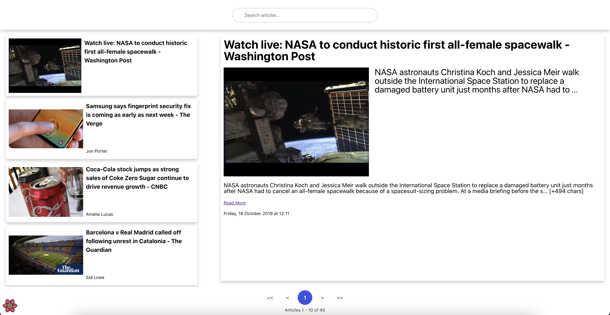
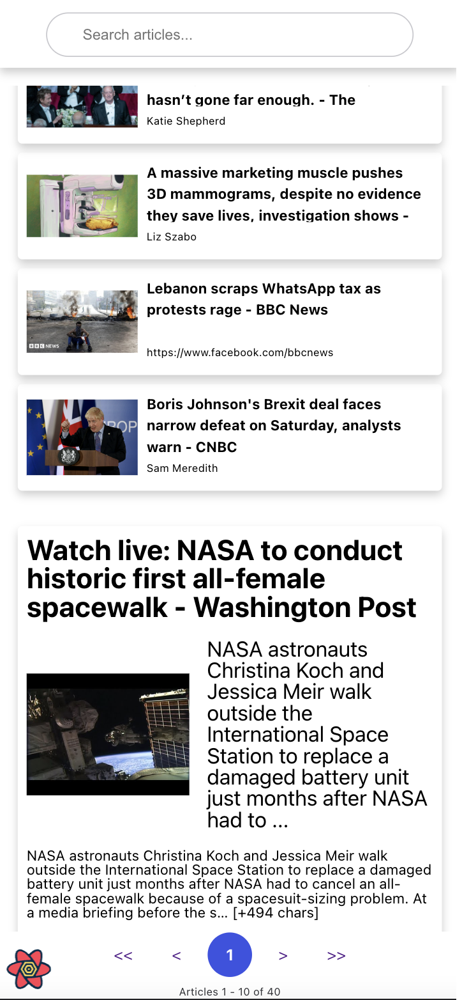

## Interview preparation
The current repository contains a TypeScript application and an API. The TypeScript app contains a list and a detailed view of news articles fetched from an API. The API contains the endpoint used to fetch the news articles.

The application was built with two columns and behaves like this:

- The left side shows the list of news articles.
   * When you click on one of the articles in the list, the content is shown in the other section.
- The right side with a detailed view of the current active article, or an empty view if none is selected.

The app looks like the images below:

### Desktop

  

### Mobile

  

## Homework

Before the interview we would like for you to explore the app and get familiar with the code and it's structure.

The repository has 2 branches: **master** and **development**. We want you to open a Pull Request from **development** to **master** and review our code. Please add some comments on things you would improve or change. Do not be too exhaustive in your comments, you will have time during the interview to explain them.

Feel free to checkout the development branch, run the app and play around with the code. Be prepared to share your screen and fix, improve and implement new features during the interview!

## Aplication
[DEVELOPMENT.md](DEVELOPMENT.md) contains all the needed explanations for starting the application and how the API works.